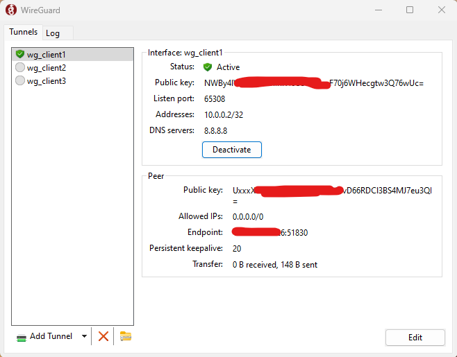

## Setting Up WireGuard VPN with Ansible for Ubuntu

### [RU documentation](README_RU.md)
  
### Quick Start
1.Clone the repository to your system, for example to **HOME/YOUR_USER/ansible-project/**

```git clone git@github.com:quoterbox/wireguard-via-ansible-playbook.git ansible-project```

2.Specify the IP address of your server in the **hosts.ini** file under the **[www]** block:  
```
[local]
localhost ansible_connection=local

[www]
111.111.111.111
```
3.Set the minimum necessary settings in the **group_vars/main.yml** file:
```
# The username on the computer from which the remote server configuration is performed
localhost_user: yourLocalUser

# Any name, used only to identify SSH keys
# It is recommended to use a name that identifies the server being configured.
server_name: YourAnyNameForServer

# Domain or IP address of the remote server (the same as in hosts.ini)
remote_host: "111.111.111.111"

# Can be left as default
# User with root privileges, for generating SSH keys for future connection to the server and its configuration
root_user: root

# Clients for whom keys need to be created and given access to the VPN, can be one or more
# The client's name can be any unique name, it will correspond to the config and key names
wg_clients:
  - name: client1
  - name: client2
  - name: client3

# Directory on the local computer where the ready config files for each client's setup will be saved.
wg_conf_dest_dir: "/home/yourOwnUserFolder/conf_files/"
``` 

4.Make sure you have Python installed:

```python --version```

or

```python3 --version```

5.Install Ansible on the computer from which the remote server configuration is performed:

```sudo apt install ansible```

6.Make sure Ansible is installed:

```ansible --version```

7.Create SSH key files on the local computer by running the first local playbook from the playbooks folder **HOME/YOUR_USER/ansible-project/**:

```ansible-playbook -i hosts.ini localhost_playbook.yml --ask-become-pass```

8.If the keys are successfully created, they will appear by default in the `~/.ssh/` folder.

9.Copy the public key to the remote server, replacing the IP address in the command with your server's IP:

```ssh-copy-id -i ~/.ssh/root_wg_server root@111.111.111.111```

In this command, `~/.ssh/root_wg_server` - is if you left the settings as default.

10.Enter the root user's password when prompted in the terminal to confirm the SSH key copy.
11.To verify that the keys were successfully copied, try logging into the server without a password using the command:

```ssh root@111.111.111.111```

12.Run the playbook to set up WireGuard on the server:

```ansible-playbook -i hosts.ini playbook.yml```

13.Download the WireGuard application for your device (Windows, Linux, Android, iOS etc).

https://www.wireguard.com/install/

14.Create configuration files for the clients, which can be downloaded and used in the WireGuard application:

```ansible-playbook -i hosts.ini conf_file_playbook.yml```

15.Download the client config files to the local computer:

```ansible-playbook -i hosts.ini download_conf_files.yml```

16.Specify the required config file for the necessary client in the application on your local computer from the folder specified in the settings:

```
# Файл group_vars/main.yml
wg_conf_dest_dir: "/home/yourOwnUserFolder/conf_files/"
```



16.Click connect and check the VPN operation, for example here:

https://api.myip.com


### Description of all settings in the group_vars/main.yml file
```
# The username on the computer from which the remote server configuration is performed
localhost_user: yourLocalUser

# Path to the config file where the host and user mapping will be saved
config_file: ".ssh/config"

# Any name, used only to identify SSH keys
# It is recommended to use a name that identifies the server being configured.
server_name: YourAnyNameForServer

# Domain or IP address of the remote server (the same as in hosts.ini)
remote_host: "111.111.111.111"

# User with root privileges, for generating SSH keys for future connection to the server and its configuration
root_user: root

# SSH keys for connecting to the remote server
root_key_name: "{{root_user}}_{{ server_name }}"
root_private_key_file: ".ssh/{{ root_key_name }}"
root_public_key_file: ".ssh/{{ root_key_name }}.pub"

# Path to the WireGuard service where the WireGuard keys will be stored
wg_path: "/etc/wireguard"

# Public and private key for the WireGuard interface/server
wg_server_private_key_file: "{{ wg_path }}/privatekey"
wg_server_public_key_file: "{{ wg_path }}/publickey"

# IP address of the interface/server, port, and the name of the network interface for WireGuard in the future VPN network
wg_server_ip: "10.0.0.1/24"
wg_server_port: 51830
wg_server_eth_adapter: "eth0"

# Clients for whom keys need to be created and given access to the VPN, can be one or more
# The client's name can be any unique name, it will correspond to the config and key names
wg_clients:
  - name: client1
  - name: client2
  - name: client3

# IP address of the first client, subsequent clients will receive an address incremented by 1, e.g., 10.0.0.3, 10.0.0.4, etc.
wg_base_client_ip: "10.0.0.2"

# Subnet used for clients
wg_client_subnet: "/32"

# Client DNS
wg_client_dns: "8.8.8.8"

# Directory on the local computer where the ready config files for each client's setup will be saved.
wg_conf_dest_dir: "/home/yourOwnUserFolder/conf_files/"

# Other settings
wg_conf_client_AllowedIPs: "0.0.0.0/0"
wg_conf_client_PersistentKeepalive: 20
```

### LICENSE

[MIT License](./LICENSE.md) 

### Author
[JQ/Quoterbox](https://github.com/quoterbox)
