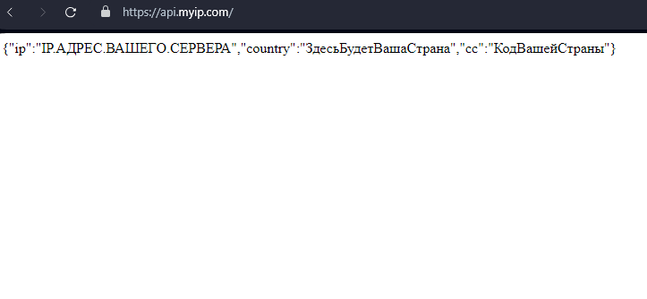

## Настройка WireGuard VPN с помощью Ansible для Ubuntu

### [EN documentation](README.md)
  
### Быстрый старт
1.Склонируйте себе репозиторий, например в **HOME/ВАШ_ПОЛЬЗОВАТЕЛЬ/ansible-project/**

```git clone git@github.com:quoterbox/wireguard-via-ansible-playbook.git ansible-project```

2.Укажите в файле **hosts.ini** IP адрес своего сервера в блоке **[www]**:  
```
[local]
localhost ansible_connection=local

[www]
111.111.111.111
```
3.Задайте минимально необходимые настройки в файле **group_vars/main.yml**:
```
# Имя пользователя на компьютере, с которого производится настройка удаленного сервера
localhost_user: yourLocalUser

# Любое имя, будет использоваться только для идентификации SSH ключей
# Рекомендуется использовать имя, идентифицирующее сервер, для которого идет настройка.
server_name: YourAnyNameForServer

# Домен или IP адрес удаленного сервера (тот же что и в hosts.ini)
remote_host: "111.111.111.111"

# Можно оставить по умолчанию 
# Пользователь с правами root, для генерации SSH ключей для будущего подключения к серверу и его настройки
root_user: root

# Клиенты, для которых нужно создать ключи и дать доступ к VPN, может быть другое количество 1 или больше
# Имя клиента может быть любым уникальным, будет соответствовать именам конфигов и ключей
wg_clients:
  - name: client1
  - name: client2
  - name: client3

# Директория на локальном компьютере, куда будут сохраняться готовые конфиг файлы для настройки каждого клиента.
wg_conf_dest_dir: "/home/yourOwnUserFolder/conf_files/"
``` 

4.Убедитесь, что у вас установлен Python:

```python --version```

или

```python3 --version```

5.Установите Ansible на компьютер, с которого производится настройка удаленного сервера:

```sudo apt install ansible```

6.Убедитесь, что Ansilbe установлен:

```ansible --version```

7.Создаем на локальном компьютере файлы SSH ключей, запуская первый локальный плейбук из папки с плейбуками 
**HOME/ВАШ_ПОЛЬЗОВАТЕЛЬ/ansible-project/**:

```ansible-playbook -i hosts.ini localhost_playbook.yml --ask-become-pass```

8.Если ключи успешно созданы, то они появятся по умолчанию в папке `~/.ssh/`

9.Копируем публичный ключ на удаленный сервер, не забывая заменить IP адрес в команде на IP своего сервера:

```ssh-copy-id -i ~/.ssh/root_wg_server root@111.111.111.111```

В данной команде `~/.ssh/root_wg_server` - если вы оставили настройки по умолчанию

10.Вводим пароль от root пользователя при запросе в терминале, чтобы подтвердить копирование SSH ключей
11.Чтобы проверить, что ключи успешно скопированы, пробуем зайти на сервер без пароля с помощью команды:

```ssh root@111.111.111.111```

12.Запускаем плейбук настройки WireGuard на сервере:

```ansible-playbook -i hosts.ini playbook.yml```

13.Создаем конфигурационные файлы для клиентов, которые можно будет скачать и использовать в приложении WireGuard

```ansible-playbook -i hosts.ini conf_file_playbook.yml```

14.Скачиваем файлы конфигов для клиентов на локальный компьютер:

```ansible-playbook -i hosts.ini download_conf_files.yml```

15.Указываем в приложении на локальном комьютере нужный файл конфигов для нужного клиента из папки, которую мы указали в настройках:

```
# Файл group_vars/main.yml
wg_conf_dest_dir: "/home/yourOwnUserFolder/conf_files/"
```


16.Нажимаем подключить, проверяем работу VPN, например тут:

https://api.myip.com




### Описание всех настроек в файле group_vars/main.yml
```
# Имя пользователя на компьютере, с которого производится настройка удаленного сервера
localhost_user: yourLocalUser

# Путь до config файла, в котором будет сохраняться соответствие host и user
config_file: ".ssh/config"

# Любое имя, будет использоваться только для идентификации SSH ключей
# Рекомендуется использовать имя, идентифицирующее сервер, для которого идет настройка.
server_name: YourAnyNameForServer

# Домен или IP адрес удаленного сервера (тот же что и в hosts.ini)
remote_host: "111.111.111.111"

# Пользователь с правами root, для генерации SSH ключей для будущего подключения к серверу и его настройки
root_user: root

# SSH ключи для подключения к удаленному серверу
root_key_name: "{{root_user}}_{{ server_name }}"
root_private_key_file: ".ssh/{{ root_key_name }}"
root_public_key_file: ".ssh/{{ root_key_name }}.pub"

# Путь до сервиса WireGuard, где будут храниться ключи WireGuard
wg_path: "/etc/wireguard"

# Публичный и приватный ключ интерфейса/сервера для WireGuard
wg_server_private_key_file: "{{ wg_path }}/privatekey"
wg_server_public_key_file: "{{ wg_path }}/publickey"

# IP адрес интерфейса/сервера, порт и название сетевого интерфейса WireGuard в будущей VPN сети
wg_server_ip: "10.0.0.1/24"
wg_server_port: 51830
wg_server_eth_adapter: "eth0"

# Клиенты, для которых нужно создать ключи и дать доступ к VPN, может быть другое количество 1 или больше
# Имя клиента может быть любым уникальным, будет соответствовать именам конфигов и ключей
wg_clients:
  - name: client1
  - name: client2
  - name: client3

# IP адрес первого клиента, следующие клиенты получат адрес на 1 больше, например, 10.0.0.3, 10.0.0.4 и тд
wg_base_client_ip: "10.0.0.2"

# Подсеть, используемая для клиентов
wg_client_subnet: "/32"

# Клиентский ДНС
wg_client_dns: "8.8.8.8"

# Директория на локальном компьютере, куда будут сохраняться готовые конфиг файлы для настройки каждого клиента.
wg_conf_dest_dir: "/home/yourOwnUserFolder/conf_files/"

# Прочие настройки
wg_conf_client_AllowedIPs: "0.0.0.0/0"
wg_conf_client_PersistentKeepalive: 20
```

### Лицензия

[MIT License](./LICENSE.md) 

### Автор
[JQ/Quoterbox](https://github.com/quoterbox)
